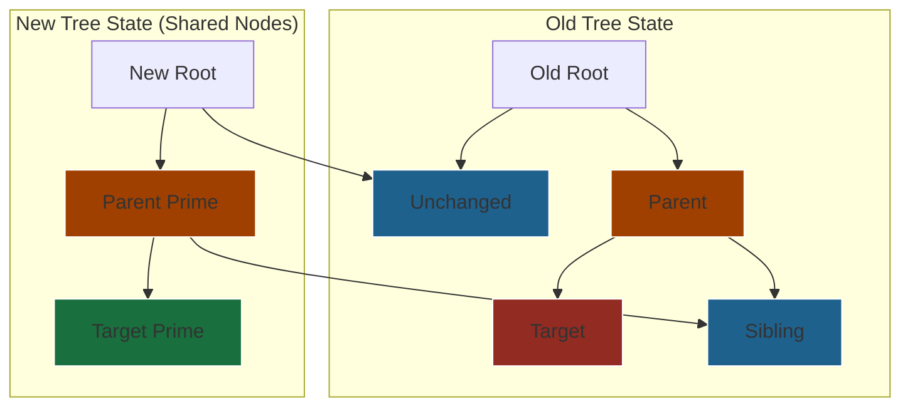
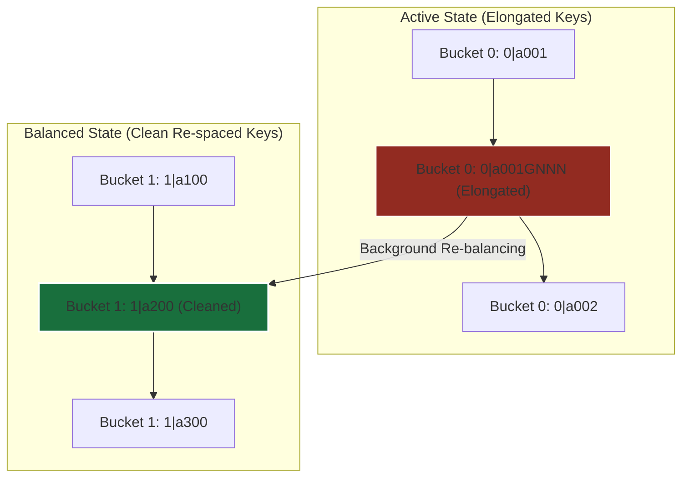

# Engineering Specifications of Block-Based Document Architectures: AST Modeling, Relational Persistence, and Concurrent Sequencing

The engineering requirements of modern collaborative document editors dictate a shift from classical HTML-string serialization and mutable, browser-tied Document Object Models (DOM). To guarantee structural integrity, support granular offline updates, and resolve concurrent edits deterministically, production systems implement structured, block-based architectures. This report details the technical specifications, persistent data layers, and algorithmic mechanisms underlying modern block-based document trees.

---

## 1. The Abstract Syntax Tree (AST) & In-Memory Model

### Immutability, Persistent Data Structures, and the Virtualized Document Representation

In framework-agnostic rich text engines such as ProseMirror or Lexical, a document is modeled as an immutable, persistent abstract syntax tree (AST)[^1]. Unlike the browser DOM, which relies on mutable node objects with unique, physical identities, the in-memory AST treats nodes as pure, immutable values[^2].

To optimize performance and memory usage during mutations, document engines use persistent data structures with structural sharing[^2]. When an edit occurs (e.g., inserting a character or changing a block's formatting), the engine does not perform in-place mutation of the parent node. Instead, it runs an update cycle that generates a new transaction[^1]. This transaction clones only the directly affected node and its ancestor path up to the root, while leaving unrelated sub-trees unchanged and shared by reference[^2].



This structural sharing yields an $O(\log N)$ time complexity for updates, where $N$ is the number of nodes in the document. It also provides immediate, zero-cost snapshotting[^3]. Because snapshots are immutable pointer references to historic root nodes, features like multi-level undo-redo systems, version tracking, and asynchronous collaborative reconciliation are highly efficient, requiring no deep copies of the document state[^3].

### JSON Schema Modeling of Hierarchical Block Structures

The AST maintains strict structural containment through a schema that defines how nodes nest, their attributes, and their semantic limits[^2]. Within this schema, nodes generally fall into three categories:

1. **Structural Container Nodes:** Nodes like `page`, `column_list`, and `column` that do not hold direct text content but organize the document layout[^2].
2. **Text Block Nodes:** Intermediate nodes such as `paragraph` and `heading` that contain inline child nodes[^2].
3. **Leaf and Decorator Nodes:** Inline or block-level elements that do not support recursive child nesting, such as a `horizontal_rule` or a self-contained, interactive `image`[^2].

The following JSON model defines a production-grade schema representation of a document containing nested columns, textblocks, marks, and leaf decorators:

```json
{
  "type": "doc",
  "attrs": {
    "schema_version": "2.1.0",
    "document_id": "8f39b980-dfb6-455a-b605-67c4ec2db922"
  },
  "content": [
    {
      "id": "block_page_01",
      "type": "page",
      "attrs": {
        "title": "Systems Engineering Overview"
      },
      "content": [
        {
          "id": "block_col_list_01",
          "type": "column_list",
          "attrs": {
            "columns_count": 2,
            "gap_px": 16
          },
          "content": [
            {
              "id": "block_col_01",
              "type": "column",
              "attrs": {
                "flex_grow": 1,
                "width_percentage": 50.0
              },
              "content": [
                {
                  "id": "block_h1_01",
                  "type": "heading",
                  "attrs": {
                    "level": 1
                  },
                  "content": [
                    {
                      "type": "text",
                      "text": "AST Document Architecture"
                    }
                  ]
                },
                {
                  "id": "block_p_01",
                  "type": "paragraph",
                  "content": [
                    {
                      "type": "text",
                      "text": "Block hierarchies support "
                    },
                    {
                      "type": "text",
                      "text": "immutable updates",
                      "marks": [
                        {
                          "type": "strong"
                        },
                        {
                          "type": "link",
                          "attrs": {
                            "href": "https://en.wikipedia.org/wiki/Persistent_data_structure"
                          }
                        }
                      ]
                    },
                    {
                      "type": "text",
                      "text": "."
                    }
                  ]
                }
              ]
            },
            {
              "id": "block_col_02",
              "type": "column",
              "attrs": {
                "flex_grow": 1,
                "width_percentage": 50.0
              },
              "content": [
                {
                  "id": "block_img_01",
                  "type": "image",
                  "attrs": {
                    "src": "https://cdn.internal.net/ast_diagram.svg",
                    "alt_text": "Visualizing AST Node Spans",
                    "caption": "Figure 1: Tree structural visualization"
                  }
                },
                {
                  "id": "block_hr_01",
                  "type": "horizontal_rule"
                }
              ]
            }
          ]
        }
      ]
    }
  ]
}
```

### Inline Styling Annotations as Marks

In standard web pages, inline styles are represented as deeply nested element tags (e.g., `<b><i>text</i></b>`). This nested model is highly prone to layout fracturing[^8]. If a selection crosses a formatting boundary, updating the style requires splitting and reconstructing the DOM tags, which frequently results in malformed structures or rendering bugs[^8].

To prevent this, production-grade text engines flatly model inline text segments within a textblock[^2]. Rather than nesting nodes deeper, the inline content is kept as a flat sequence of text spans, and formatting is stored as metadata on each span using a structure called a "mark"[^2].

When a user applies a format like bold or an italic style to a partial text range:
1. The engine calculates the character start and end offsets within the textblock[^2].
2. It splits the underlying flat text nodes at the selection boundaries[^8].
3. It appends the corresponding Mark metadata object to the text spans in that range[^2].
4. Finally, adjacent text nodes with identical marks are automatically merged, and empty nodes are cleaned up[^2].

> [!INFO] **Inline Format Split Transition**
> **Raw State:**
> `[ Text: "This is formatted text" ]` (No Marks)
> 
> **Bold applied to "formatted":**
> `[ Text: "This is " ]` $\rightarrow$ `[ Text: "formatted", Marks: [strong] ]` $\rightarrow$ `[ Text: " text" ]`

To maintain consistent rendering and prevent DOM tree ambiguity, the editor's schema enforces a strict global sort order on marks (e.g., `link` always wraps `strong`, which always wraps `em`)[^2]. This schema-driven ordering ensures that the AST translates to a single, deterministic DOM representation[^2]. It also prevents styling bugs, such as broken hyperlinks or split hover states when styles overlap[^9].

---

## 2. Database Persistence & Relational Maps

### Normalized Relational Schema Design

Persisting a recursive, block-based tree in a relational database like PostgreSQL requires balancing query latency, write performance, and transaction safety. The two primary relational paradigms are the **Ordered Children Array** model and the **Parent-Pointer / Linked List** model[^10].

```sql
-- Core schemas and extensions
CREATE EXTENSION IF NOT EXISTS "uuid-ossp";

CREATE TABLE documents (
  id UUID PRIMARY KEY DEFAULT gen_random_uuid(),
  workspace_id UUID NOT NULL,
  version INT NOT NULL DEFAULT 1,
  created_at TIMESTAMPTZ NOT NULL DEFAULT clock_timestamp(),
  updated_at TIMESTAMPTZ NOT NULL DEFAULT clock_timestamp()
);

-- Polymorphic Document Blocks (Hybrid Single-Table Inheritance with JSONB attributes)
CREATE TABLE blocks (
  id UUID PRIMARY KEY DEFAULT gen_random_uuid(),
  document_id UUID NOT NULL REFERENCES documents(id) ON DELETE CASCADE,
  type VARCHAR(50) NOT NULL, -- 'doc', 'page', 'column_list', 'column', 'paragraph', 'heading', 'image', 'horizontal_rule'
  content JSONB DEFAULT NULL, -- Flat text span arrays for textblocks, or null for layout blocks
  attrs JSONB NOT NULL DEFAULT '{}'::jsonb, -- Node specific properties
  created_at TIMESTAMPTZ NOT NULL DEFAULT clock_timestamp(),
  updated_at TIMESTAMPTZ NOT NULL DEFAULT clock_timestamp()
);
```

### Schema A: Ordered Children Array Model

In this model, the hierarchical relationship is defined by parent blocks that store an ordered array of their child UUIDs[^10]. Individual block rows contain no reference to their parents or siblings.

```sql
CREATE TABLE ordered_array_hierarchy (
  parent_block_id UUID NOT NULL REFERENCES blocks(id) ON DELETE CASCADE,
  child_ids UUID[] NOT NULL DEFAULT '{}'::UUID[], -- Ordered array of child block UUIDs
  PRIMARY KEY (parent_block_id)
);

CREATE INDEX idx_ordered_array_child_ids ON ordered_array_hierarchy USING gin(child_ids);
```

### Schema B: Parent-Pointer / Linked List Model

In this design, child blocks store a reference to their parent block, their direct siblings (linked list), and a fractional string index to maintain global ordering[^10].

```sql
CREATE TABLE parent_pointer_hierarchy (
  block_id UUID PRIMARY KEY REFERENCES blocks(id) ON DELETE CASCADE,
  parent_block_id UUID REFERENCES blocks(id) ON DELETE CASCADE,
  prev_sibling_id UUID REFERENCES blocks(id) ON DELETE SET NULL,
  next_sibling_id UUID REFERENCES blocks(id) ON DELETE SET NULL,
  fractional_position VARCHAR(255) NOT NULL, -- Base-62 lexicographically sortable string index
  CONSTRAINT chk_self_reference CHECK (block_id <> parent_block_id)
);

CREATE INDEX idx_parent_pointer_parent_index 
ON parent_pointer_hierarchy (parent_block_id, fractional_position);
```

### Comparative Analysis of Persistence Models

The table below contrasts the trade-offs of the two persistence models under common document editing patterns.

| Technical Vector | Ordered Children Array Model | Parent-Pointer / Linked List Model |
| :--- | :--- | :--- |
| **Write Amplification (Middle Insert)** | $O(1)$ block write, but requires rewriting the parent's `child_ids` array, which can cause transaction conflicts on concurrent edits[^15]. | $O(1)$ block write. The fractional index allows immediate insertion without changing neighboring rows[^13]. |
| **Reordering Latency** | High write-locking on the parent row. However, updating order is a single array modification on the parent[^15]. | Low lock contention. Reordering only requires updating the moved row's parent and its fractional index[^13]. |
| **Concurrency Characteristics** | Poor concurrency. Multiple users inserting items under the same parent will create race conditions on the parent's `child_ids` array. | High concurrency. Appending unique client-ID suffixes to fractional indices avoids transaction collisions[^14]. |
| **Index Maintenance Overhead** | High. GIN indexing on the parent's child array is slow to write and computationally expensive to update. | Low. Standard B-Tree indexing on `(parent_block_id, fractional_position)` is highly optimized for fast reads. |
| **Data Integrity and Constraints** | Low. Relational integrity constraints cannot natively validate that a child UUID exists inside the array, leading to potential orphan nodes. | High. Database-level foreign keys validate the parent-pointer, while unique indexes prevent duplicate positions[^18]. |

---

### Transactional Data Flow and Operational Lifecycle

#### Workflow 1: Text Change Mutation

A user edits text inside an existing paragraph block[^15]. This is a clean content update that does not affect document hierarchy or block order, running in a single localized transaction.


```sql
BEGIN;

-- Perform check to ensure block ownership and document consistency
SELECT 1 FROM blocks 
WHERE id = '8a221f7e-128a-40a2-b258-2039abcb9411' 
  AND document_id = '8f39b980-dfb6-455a-b605-67c4ec2db922' 
FOR UPDATE;

UPDATE blocks
SET content = '[{"type": "text", "text": "Systems engineering integrates continuous validation."}]'::jsonb,
    updated_at = clock_timestamp()
WHERE id = '8a221f7e-128a-40a2-b258-2039abcb9411';

UPDATE documents
SET updated_at = clock_timestamp()
WHERE id = '8f39b980-dfb6-455a-b605-67c4ec2db922';

COMMIT;
```

#### Workflow 2: Type Transformation

A user converts a paragraph block into a bulleted list item[^7]. In highly normalized tables, this would require deleting and re-inserting rows. In hybrid JSONB schemas, the system updates the block's type field and modifies the `attrs` payload while keeping its existing ID and position[^7].

```sql
BEGIN;

-- Lock affected block and verify transition validity
SELECT type, attrs FROM blocks 
WHERE id = '8a221f7e-128a-40a2-b258-2039abcb9411' 
FOR UPDATE;

UPDATE blocks
SET type = 'bullet_list_item',
    attrs = jsonb_set(attrs, '{indent_level}', '1'::jsonb),
    updated_at = clock_timestamp()
WHERE id = '8a221f7e-128a-40a2-b258-2039abcb9411';

COMMIT;
```

#### Workflow 3: Nested Indentation Change

A user indents an existing block, moving it to be a child of its predecessor[^15]. This requires updating both its parent reference and its fractional position index[^15].

```sql
BEGIN;

-- Acquire row locks on target, previous parent, and new parent to avoid deadlocks
SELECT id FROM blocks
WHERE id IN (
  '8a221f7e-128a-40a2-b258-2039abcb9411', -- Target Block ID
  '8f39b980-dfb6-455a-b605-67c4ec2db922'  -- New Parent Block ID
)
FOR UPDATE;

-- Update parent relationship and assign new fractional index
UPDATE parent_pointer_hierarchy
SET parent_block_id = '8f39b980-dfb6-455a-b605-67c4ec2db922', -- New Parent UUID
    fractional_position = 'a0V_client_8910', -- Midpoint under new parent
    prev_sibling_id = NULL,
    next_sibling_id = '2a319f5a-c8a1-432e-9df1-80bb9fba6333'
WHERE block_id = '8a221f7e-128a-40a2-b258-2039abcb9411';

COMMIT;
```

---

### Mitigating the Relational Join Penalty

Querying deeply nested hierarchical data in relational databases often requires repeating joins, which degrades performance as nesting depth increases[^19]. To fetch and render a document with hundreds of blocks, production engines avoid real-time relational traversals by using optimized indexing and retrieval strategies.

#### Optimization A: Materialized Path Fields (PostgreSQL `ltree`)

Path materialization denormalizes structural hierarchy by storing each node's full ancestral path as a sortable string (e.g., `root.block_01.block_02`)[^18]. PostgreSQL's native `ltree` type implements this model, indexing path strings with specialized GIST indexes to resolve sub-tree queries in $O(\log N)$ time[^18].

```sql
-- Schema with PostgreSQL ltree
CREATE TABLE materialized_path_blocks (
  id UUID PRIMARY KEY DEFAULT gen_random_uuid(),
  document_id UUID NOT NULL REFERENCES documents(id) ON DELETE CASCADE,
  path ltree NOT NULL, -- String path of node ancestry (e.g., 'root_id.parent_id.self_id')
  position_index VARCHAR(255) NOT NULL,
  type VARCHAR(50) NOT NULL,
  content JSONB
);

CREATE INDEX idx_gist_blocks_path ON materialized_path_blocks USING gist(path);
```

To fetch an entire sub-tree at any nesting depth, the engine queries the path using a simple hierarchical match, bypassing the need for recursive CTEs[^22]:

```sql
-- Retrieve all blocks nested under a target column column_01
SELECT * FROM materialized_path_blocks
WHERE document_id = '8f39b980-dfb6-455a-b605-67c4ec2db922'
  AND path <@ 'root_01.col_list_01.column_01'::ltree
ORDER BY path, position_index;
```

#### Optimization B: Write-Time Trigger Snapshot Aggregation

To optimize read paths for large, complex documents, engines use database triggers to denormalize block tables into a pre-compiled JSONB tree snapshot whenever a change is committed[^22]. This shifts compile costs to write operations, allowing read requests to fetch the entire document with a single, fast primary-key lookup[^24].

```sql
CREATE TABLE document_compiled_snapshots (
  document_id UUID PRIMARY KEY REFERENCES documents(id) ON DELETE CASCADE,
  compiled_tree JSONB NOT NULL,
  compiled_at TIMESTAMPTZ NOT NULL DEFAULT clock_timestamp()
);

-- Recursive function to generate the JSONB nested tree representation
CREATE OR REPLACE FUNCTION build_snapshot_node_json(p_doc_id UUID, p_parent_id UUID)
RETURNS JSONB AS $$
DECLARE
  v_children JSONB;
BEGIN
  SELECT jsonb_agg(
    jsonb_build_object(
      'id', b.id,
      'type', b.type,
      'content', b.content,
      'attrs', b.attrs,
      'children', COALESCE(build_snapshot_node_json(p_doc_id, b.id), '[]'::jsonb)
    ) ORDER BY pph.fractional_position ASC
  ) INTO v_children
  FROM blocks b
  JOIN parent_pointer_hierarchy pph ON b.id = pph.block_id
  WHERE b.document_id = p_doc_id
    AND pph.parent_block_id = p_parent_id;

  RETURN COALESCE(v_children, '[]'::jsonb);
END;
$$ LANGUAGE plpgsql STABLE;
```

---

## 3. Concurrent Sequencing & Fractional Indexing

### Mechanics of Fractional Indexing

When users drag-and-drop elements or insert blocks, updating traditional integer sequence indexes requires shifting all subsequent rows, causing massive write amplification[^14]. Fractional indexing avoids this by assigning lexicographically sortable string keys to elements, allowing insertions between any two blocks without modifying surrounding indices[^13].

The default base-62 alphabet containing alphanumeric characters `0-9`, `A-Z`, and `a-z` is commonly used because it matches natural ASCII byte order[^26]. This allows standard database queries to sort rows using simple, high-performance lexicographical sorting[^13]:

> [!NOTE] **Base-62 Lexicographical Collation Order**
> `'0'` (0x30) $<$ `'9'` (0x39) $<$ `'A'` (0x41) $<$ `'Z'` (0x5A) $<$ `'a'` (0x61) $<$ `'z'` (0x7A)

Using these alphanumeric keys, the system represents integer boundaries with length prefixes, while fractional positions are appended as extra characters to resolve inner midpoints[^26].

- **Index Positions:** `"a0"` (Integer 0) $\rightarrow$ `"a1"` (Integer 1)
- **New Insertion:** `"a0"` (Integer 0) $\rightarrow$ `"a0V"` $\rightarrow$ `"a1"` (Integer 1)

Here, `"V"` is the midpoint of the base-62 alphabet, inserting the new element exactly between `"a0"` and `"a1"`[^27].

### Midpoint Mathematical Algorithm

To calculate a midpoint between two fractional indexing keys, string inputs are treated as base-62 fractional digits. The base-62 alphabet is mapped to numerical values:

$$\Sigma = \{ '0' : 0, '1' : 1, \dots, 'Z' : 35, 'a' : 36, \dots, 'z' : 61 \}$$

Let fractional string $S = s_0 s_1 \dots s_{k-1}$ represent a real value $V(S)$:

$$V(S) = \sum_{i=0}^{k-1} \text{char}(s_i) \times 62^{-(i+1)}$$

To compute a key between two points, the strings are padded to normalize their lengths[^29]. The algorithm then performs base-62 math to calculate the average value and translates it back into a sortable string[^29]:

```typescript
function getBase62Value(char: string): number {
  const chars = "0123456789ABCDEFGHIJKLMNOPQRSTUVWXYZabcdefghijklmnopqrstuvwxyz";
  return chars.indexOf(char);
}

function getBase62Char(val: number): string {
  const chars = "0123456789ABCDEFGHIJKLMNOPQRSTUVWXYZabcdefghijklmnopqrstuvwxyz";
  return chars[val];
}

function computeBase62Midpoint(prev: string, next: string): string {
  // Normalize lengths and pad with an extra digit to ensure division space
  const maxLen = Math.max(prev.length, next.length) + 1;
  const pPadded = prev.padEnd(maxLen, '0');
  const nPadded = next === "" ? "z".repeat(maxLen) : next.padEnd(maxLen, '0');

  // Convert normalized strings to integer arrays
  const pDigits = Array.from(pPadded).map(getBase62Value);
  const nDigits = Array.from(nPadded).map(getBase62Value);

  // Perform base-62 arithmetic addition and division by two
  const midDigits: number[] = new Array(maxLen).fill(0);
  let carry = 0;

  // Add digit arrays from right to left
  for (let i = maxLen - 1; i >= 0; i--) {
    const sum = pDigits[i] + nDigits[i] + carry;
    midDigits[i] = sum % 62;
    carry = Math.floor(sum / 62);
  }

  // Divide the sum array by 2 from left to right
  let remainder = carry;
  for (let i = 0; i < maxLen; i++) {
    const val = midDigits[i] + remainder * 62;
    midDigits[i] = Math.floor(val / 2);
    remainder = val % 2;
  }

  // Convert numerical digits back to base-62 string
  let result = midDigits.map(getBase62Char).join('');

  // Trim trailing zeros to maintain compact index keys
  return result.replace(/0+$/, '');
}
```

This mathematical translation guarantees predictable midpoints for any arbitrary sequence bounds[^29]:

$$\text{computeBase62Midpoint("0", "1")} \Longrightarrow \text{"0V"}$$
$$\text{computeBase62Midpoint("a", "b")} \Longrightarrow \text{"aV"}$$
$$\text{computeBase62Midpoint("0", "01")} \Longrightarrow \text{"00V"}$$

---

### The Index Elongation Bug & Production Mitigations

When users repeatedly insert elements at the same relative position (e.g., continually adding a new block at the beginning of a column list), midpoint division causes the generated keys to grow increasingly long[^31].

$$\text{"G"} \Longrightarrow \text{"GN"} \Longrightarrow \text{"GNN"} \Longrightarrow \text{"GNNN"} \Longrightarrow \text{"GNNNN"} \Longrightarrow \dots$$

Over time, these elongated keys degrade sorting performance, increase database storage overhead, and can eventually hit database column constraints[^31]. Production engines prevent this using two key architectural optimizations.

#### Mitigation A: Automated Background Bucket Re-balancing

Production-grade systems, such as Jira's LexoRank engine, partition sequence keys into separate buckets (e.g., buckets `0`, `1`, and `2`)[^32].



1. **Length Evaluation:** An asynchronous database monitor tracks index key lengths[^32]. When a block's index length crosses a set threshold (e.g., 100 characters), a re-balancing sweep is scheduled[^32].
2. **Lock-Free Relational Remapping:** The re-balancer reads the active items sorted by their current keys[^31]. It calculates new, short, evenly spaced keys using an alternate inactive bucket namespace (e.g., moving keys from bucket `0` to bucket `1`)[^32].
3. **Atomic Pointer Swapping:** The newly generated keys are written directly to the database[^32]. Once the transaction commits, the system swaps the active bucket configuration, and the old bucket is cleared[^32].

This multi-bucket strategy ensures re-balancing is non-blocking, keeping sorting keys compact and fast without interrupting active users[^32].

#### Mitigation B: Client ID Append and Collision Resolution

In real-time, distributed environments, concurrent actions can generate identical index keys[^14]. If two clients offline-insert a block at the exact same relative position, their calculated midpoints will conflict, creating a sorting collision[^14].

To resolve this, production engines append a deterministic tie-breaker suffix to every fractional index[^14]:

$$\text{Sorting Key} = \text{Fractional Index} + \text{"\_"} + \text{Client ID}$$

When sorting indices, lexicographical string comparison naturally orders colliding keys using the client ID, ensuring consistent and conflict-free sequence views across all active users[^14].

---

### Real-Time Synchronization Operational Transformation Logs

To minimize synchronization payloads and network overhead, modern document architectures avoid transferring full documents[^17]. Instead, they transmit edits as an append-only stream of operational changes, preserving user intent and tracking edits sequentially[^15].

```json
{
  "document_id": "8f39b980-dfb6-455a-b605-67c4ec2db922",
  "client_id": "usr_9924a",
  "operations_log": [
    {
      "sequence_number": 1042,
      "type": "insert_block",
      "payload": {
        "block_id": "block_p_99",
        "parent_id": "block_col_01",
        "block_type": "paragraph",
        "position_index": "a1V_usr_9924a",
        "attributes": {
          "placeholder": "Write your abstract..."
        }
      }
    },
    {
      "sequence_number": 1043,
      "type": "update_block_content",
      "payload": {
        "block_id": "block_p_99",
        "delta_operation": [
          { "insert": "Systems engineering incorporates validation processes." }
        ]
      }
    },
    {
      "sequence_number": 1044,
      "type": "append_child",
      "payload": {
        "parent_id": "block_p_99",
        "child_id": "block_span_99a"
      }
    }
  ]
}
```

Rather than overwriting full records, peer nodes use sequence CRDTs like Yjs (using the YATA algorithm) to parse these incoming operational logs[^5]. By verifying the neighbor boundaries (`originLeft` and `originRight`) of each mutation log, the engine deterministically integrates concurrent changes on all clients, ensuring eventually consistent and conflict-free documents without needing a central coordinating server[^5].

---

## Works Cited

[^1]: Mark - ProseMirror Reference manual, [prosemirror.net/docs/ref/version/0.11.0.html](https://prosemirror.net/docs/ref/version/0.11.0.html)
[^2]: ProseMirror Guide, [prosemirror.net/docs/guide/](https://prosemirror.net/docs/guide/)
[^3]: website/markdown/guide/doc.md at master · ProseMirror/website - GitHub, [github.com/ProseMirror/website/blob/master/markdown/guide/doc.md](https://github.com/ProseMirror/website/blob/master/markdown/guide/doc.md)
[^4]: ProseMirror Reference manual, [prosemirror.net/docs/ref/version/0.13.0.html](https://prosemirror.net/docs/ref/version/0.13.0.html)
[^5]: yjs/yjs: Shared data types for building collaborative software - GitHub, [github.com/yjs/yjs](https://github.com/yjs/yjs)
[^6]: Yjs vs Automerge vs Loro: CRDT Libraries 2026 - PkgPulse, [pkgpulse.com/guides/yjs-vs-automerge-vs-loro-crdt-libraries-2026](https://www.pkgpulse.com/guides/yjs-vs-automerge-vs-loro-crdt-libraries-2026)
[^7]: Automerge prosemirror bindings - GitHub, [github.com/automerge/automerge-prosemirror](https://github.com/automerge/automerge-prosemirror)
[^8]: The Unreasonable Effectiveness of ProseMirror Model in Rich Text Transformation, [smoores.dev/post/unreasonable_effectiveness_of_prosemirror/](https://smoores.dev/post/unreasonable_effectiveness_of_prosemirror/)
[^9]: Prevent marks from breaking up links - discuss.ProseMirror, [discuss.prosemirror.net/t/prevent-marks-from-breaking-up-links/401](https://discuss.prosemirror.net/t/prevent-marks-from-breaking-up-links/401)
[^10]: Apache Impala Guide, [impala.apache.org/docs/build/impala-3.3.pdf](https://impala.apache.org/docs/build/impala-3.3.pdf)
[^11]: impala-4.0.pdf, [impala.apache.org/docs/build/impala-4.0.pdf](https://impala.apache.org/docs/build/impala-4.0.pdf)
[^12]: algorithm - How to build a tree from a flat structure? - Stack Overflow, [stackoverflow.com/questions/444296/how-to-build-a-tree-from-a-flat-structure](https://stackoverflow.com/questions/444296/how-to-build-a-tree-from-a-flat-structure)
[^13]: A Pragmatic Approach to Live Collaboration - Hex, [hex.tech/blog/a-pragmatic-approach-to-live-collaboration/](https://hex.tech/blog/a-pragmatic-approach-to-live-collaboration/)
[^14]: Fractional Indexing - vlcn.io, [vlcn.io/blog/fractional-indexing](https://vlcn.io/blog/fractional-indexing)
[^15]: Board Application: Frontend Architecture - I Code It, [frontend.icodeit.com.au/case-studies/board-application](https://frontend.icodeit.com.au/case-studies/board-application)
[^16]: elixir-saas/ecto_orderable: Add orderable sets with Ecto to your existing database. - GitHub, [github.com/elixir-saas/ecto_orderable](https://github.com/elixir-saas/ecto_orderable)
[^17]: Practical CRDT usage - Webxdc, [webxdc.org/docs/shared_state/practical.html](https://webxdc.org/docs/shared_state/practical.html)
[^18]: Documentation: 18: 5.11. Inheritance - PostgreSQL, [postgresql.org/docs/current/ddl-inherit.html](https://www.postgresql.org/docs/current/ddl-inherit.html)
[^19]: Recursive Join: The Ultimate Guide - PuppyGraph, [puppygraph.com/blog/recursive-join](https://www.puppygraph.com/blog/recursive-join)
[^20]: How to increase database performance with a Recursive Common Table Expression | Blog, [krystal.io/blog/post/how-to-increase-database-performance-with-a-recursive-common-table-expression](https://krystal.io/blog/post/how-to-increase-database-performance-with-a-recursive-common-table-expression)
[^21]: USING KEY in Recursive CTEs - DuckDB, [duckdb.org/2025/05/23/using-key](https://duckdb.org/2025/05/23/using-key)
[^22]: Composite Pattern in PostgreSQL: Building Polymorphism Data Models for WebScale Apps, [sanchezcarlosjr.medium.com/composite-pattern-in-postgresql-building-hierarchical-data-models-for-persistent-applications-b09563dd1d01](https://sanchezcarlosjr.medium.com/composite-pattern-in-postgresql-building-hierarchical-data-models-for-persistent-applications-b09563dd1d01)
[^23]: Use this to lock down the schema if you have JSON or JSONB columns - YouTube, [youtube.com/watch?v=amJo48ChLGs](https://www.youtube.com/watch?v=amJo48ChLGs)
[^24]: PostgreSQL Table Inheritance and Polymorphism - Viprasol, [viprasol.com/blog/postgres-table-inheritance/](https://viprasol.com/blog/postgres-table-inheritance/)
[^25]: PostgreSQL JSONB in .NET - Marek Sirkovský - Medium, [mareks-082.medium.com/postgresql-jsonb-in-net-25fbcc7b64b2](https://mareks-082.medium.com/postgresql-jsonb-in-net-25fbcc7b64b2)
[^26]: kazu-2020/fractional_indexer: efficient data insertion and sorting through fractional indexing - GitHub, [github.com/kazu-2020/fractional_indexer](https://github.com/kazu-2020/fractional_indexer)
[^27]: sqliteai/fractional-indexing: Generate lexicographically sortable keys for reorderable lists, CRDTs, and collaborative editing. Single-file library, no dependencies, base62 by default - GitHub, [github.com/sqliteai/fractional-indexing](https://github.com/sqliteai/fractional-indexing)
[^28]: rocicorp/fractional-indexing: Fractional Indexing in JavaScript · GitHub, [github.com/rocicorp/fractional-indexing](https://github.com/rocicorp/fractional-indexing)
[^29]: unknown_url
[^30]: LexoRanks — what are they and how to use them for efficient list sorting | by Whisper Arts, [medium.com/whisperarts/lexorank-what-are-they-and-how-to-use-them-for-efficient-list-sorting-a48fc4e7849f](https://medium.com/whisperarts/lexorank-what-are-they-and-how-to-use-them-for-efficient-list-sorting-a48fc4e7849f)
[^31]: LexoRank Deep Dive: Efficient Ordering Without Mass Database Writes - Medium, [medium.com/@muhebollah.diu/lexorank-the-string-trick-that-replaces-thousands-of-database-writes-2da4ef21e38a](https://medium.com/@muhebollah.diu/lexorank-the-string-trick-that-replaces-thousands-of-database-writes-2da4ef21e38a)
[^32]: Jira's ranking system explained – TMC Application Lifecycle Management, [tmcalm.nl/blog/lexorank-jira-ranking-system-explained/](https://tmcalm.nl/blog/lexorank-jira-ranking-system-explained/)
[^33]: Jira's Lexorank algorithm for new stories - Stack Overflow, [stackoverflow.com/questions/40718900/jiras-lexorank-algorithm-for-new-stories](https://stackoverflow.com/questions/40718900/jiras-lexorank-algorithm-for-new-stories)
[^34]: nathanhleung/jittered-fractional-indexing - GitHub, [github.com/nathanhleung/jittered-fractional-indexing](https://github.com/nathanhleung/jittered-fractional-indexing)
[^35]: Postgres And Yjs CRDT Collaborative Text Editing, Using PowerSync, [powersync.com/blog/postgres-and-yjs-crdt-collaborative-text-editing-using-powersync](https://powersync.com/blog/postgres-and-yjs-crdt-collaborative-text-editing-using-powersync)
[^36]: y/y - NPM, [npmjs.com/package/@y/y](https://www.npmjs.com/package/@y/y)
[^37]: Delta-state CRDTs: indexed sequences with YATA - Bartosz Sypytkowski, [bartoszsypytkowski.com/yata/](https://www.bartoszsypytkowski.com/yata/)
[^38]: CRDTs: How Distributed Systems Agree Without Asking Permission - DEV Community, [dev.to/dev_pedro/crdts-how-distributed-systems-agree-without-asking-permission-37gc](https://dev.to/dev_pedro/crdts-how-distributed-systems-agree-without-asking-permission-37gc)
