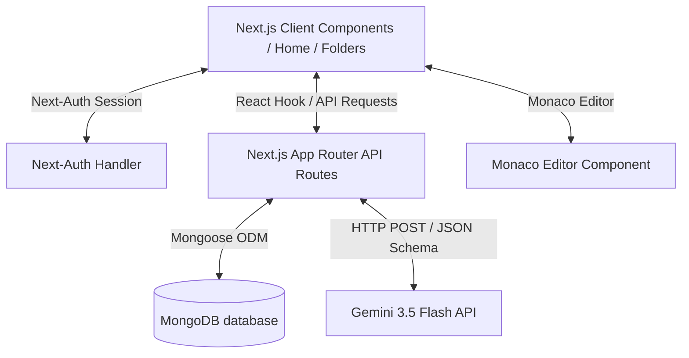
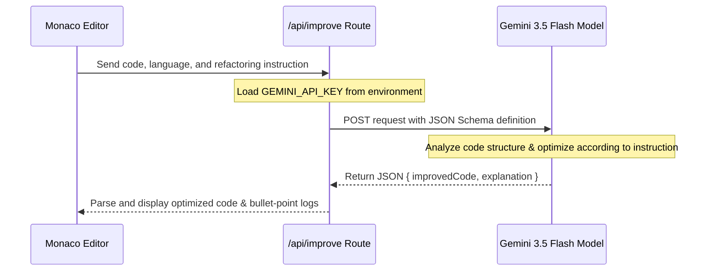

# CodeManager: The Complete Guide & Technical Blueprint

Welcome back to your project! This guide serves as a comprehensive "book" detailing everything you built in **CodeManager** (also referenced as **Code Vault**). It explains the directory structure, the database schemas, the authentication workflows, individual lines of code, the custom folder navigation state machine, API routes, and your Gemini 3.5 Flash-powered AI refactoring engine.

---

## Table of Contents
1. [System Architecture & Core Stack](#1-system-architecture--core-stack)
2. [Database Architecture & Mongoose Schemas](#2-database-architecture--mongoose-schemas)
3. [Authentication, Registration & Security Guards](#3-authentication-registration--security-guards)
4. [The Navigation State Machine (Custom React Hook)](#4-the-navigation-state-machine-custom-react-hook)
5. [Backend API Routes Breakdown](#5-backend-api-routes-breakdown)
6. [Interactive Frontend Workspaces & Monaco Editor](#6-interactive-frontend-workspaces--monaco-editor)
7. [The Gemini-Powered AI Copilot](#7-the-gemini-powered-ai-copilot)
8. [Code Review, Security Auditing, & Future Enhancements](#8-code-review-security-auditing--future-enhancements)

---

## 1. System Architecture & Core Stack

CodeManager is a modern, single-page-centric web IDE and code snippet organizer built on top of the **Next.js 15 App Router** framework. It leverages a fully dark-themed design system using **Tailwind CSS v4**, **Framer Motion** for micro-interactions, **MongoDB** for database persistence, and integrates **Monaco Editor** with an automated **Gemini 3.5 Flash** Copilot.



### The Stack:
*   **Framework**: [Next.js 15.3.5](file:///g:/Nextjs/codemanager/package.json#L32) (App Router)
*   **Database**: [MongoDB / Mongoose 8.16.2](file:///g:/Nextjs/codemanager/package.json#L30)
*   **Authentication**: [Next-Auth 4.24.11](file:///g:/Nextjs/codemanager/package.json#L33) (Credentials Provider + OAuth)
*   **Editor**: [@monaco-editor/react 4.7.0](file:///g:/Nextjs/codemanager/package.json#L12)
*   **AI Engine**: [Gemini 3.5 Flash](file:///g:/Nextjs/codemanager/app/api/improve/route.js#L67) via direct Generative Language endpoint
*   **Styling & Motion**: [Tailwind CSS v4](file:///g:/Nextjs/codemanager/package.json#L45) + [Framer Motion (motion) 12.23.9](file:///g:/Nextjs/codemanager/package.json#L31)

---

## 2. Database Architecture & Mongoose Schemas

Your database uses two core collections: one for user credentials/profiles, and a **unified tree collection** that represents both files and folders using a parent-pointer pattern (Adjacency List model).

### Database Connection: [lib/mongo.js](file:///g:/Nextjs/codemanager/lib/mongo.js)
To prevent connection leaks during development hot reloads, the MongoDB connection is cached in a global variable.
```javascript
let cached = global.mongoose;
if (!cached) {
  cached = global.mongoose = { conn: null, promise: null };
}
```
When `mongoconnect()` is invoked, it checks if `cached.conn` is already active. If not, it creates a connection promise and awaits it, returning the connection instance.

### User Schema: [models/user.js](file:///g:/Nextjs/codemanager/models/user.js)
Stores basic user registration details:
*   `name`: Plaintext display name of the user.
*   `email`: Unique email identifier (used for credentials sign-in).
*   `password`: Store hashed credentials using `bcrypt` (10 salt rounds).
*   `timestamps`: Automatically manages `createdAt` and `updatedAt` dates.

### Unified Files/Folders Schema: [models/createfilefolder.js](file:///g:/Nextjs/codemanager/models/createfilefolder.js)
Instead of dividing files and folders into separate collections, you built a polymorphic collection representing both node types.
```javascript
const folderschema = new mongoose.Schema({
    name: String,
    userid : String,
    discription : String,
    code : String,      // Used only if type === "file"
    parent : String,    // ID of parent folder, or "root" if top-level
    type : String,      // "file" or "folder"
    time :  {
        type: Date,
        default: Date.now,
    },
    language : String,  // e.g. "cpp", "javascript", "python" (for Monaco highlighting)
    breadcrumb : Array  // Precomputed ancestor list for fast path rendering
})
```

> [!NOTE]
> The `breadcrumb` array contains a list of ancestor folder paths (e.g. `[{filefolderid: "root", filefoldername: "root"}, {filefolderid: "xxx", filefoldername: "utils"}]`). This allows frontend pages to render navigation trails instantly without recursively querying parent items.

---

## 3. Authentication, Registration & Security Guards

Authentication is handled via **Next-Auth** under a unified API catch-all handler.

### Credentials & Provider Configuration: [app/api/auth/[...nextauth]/route.js](file:///g:/Nextjs/codemanager/app/api/auth/%5B...nextauth%5D/route.js)
You configured three authentication methods:
1.  **Google OAuth**: Authenticates users using Google credentials.
2.  **GitHub OAuth**: Authenticates users using GitHub credentials.
3.  **Credentials**: Enables local registration and login using emails and hashed passwords.

#### Credentials Authorization Function:
```javascript
async authorize(credentials) {
  const { email, password } = credentials;
  try {
    await mongoconnect();
    const user = await User.findOne({ email });
    if (!user) { return null; }

    const passwordsMatch = await bcrypt.compare(password, user.password);
    if (!passwordsMatch) { return null; }

    return user; 
  } catch (error) {
    console.log("Error: ", error);
    return null;
  }
}
```

#### JWT and Session Callbacks:
To map database identifiers seamlessly from either OAuth providers or credentials database entries to your session payload, the Next-Auth callbacks translate the MongoDB `_id` into `token.id` and pass it to client sessions:
```javascript
callbacks: {
  async jwt({ token, user }) {
    if (user) {
      token.id = user._id?.toString() || user.id;
    }
    return token;
  },
  async session({ session, token }) {
    if (token) {
      session.user.id = token.id;
    }
    return session;
  }
}
```

### Route Protection: [middleware.js](file:///g:/Nextjs/codemanager/middleware.js)
Your website prevents unauthenticated users from visiting `/home` and `/folders` by implementing Next-Auth middleware:
```javascript
export { default } from "next-auth/middleware";
export const config = {
  matcher: ["/home/:path*", "/folders/:path*"],
};
```
If a user is not authenticated, they are automatically redirected to `/login` (which renders [components/login-form.jsx](file:///g:/Nextjs/codemanager/components/login-form.jsx) and [app/login/page.js](file:///g:/Nextjs/codemanager/app/login/page.js)).

### User Registration: [app/api/auth/register/route.js](file:///g:/Nextjs/codemanager/app/api/auth/register/route.js)
Provides a POST handler that checks if a user already exists with the given email, hashes the input password using `bcrypt` (10 rounds), and stores the new user account in MongoDB.

---

## 4. The Navigation State Machine (Custom React Hook)

To make file tree navigation responsive and consistent across multiple layouts, you consolidated the traversal logic into a custom hook.

### [hooks/useFolderNavigation.js](file:///g:/Nextjs/codemanager/hooks/useFolderNavigation.js)
This hook acts as a state machine managing navigation history, breadcrumbs, and directory lookups.

```javascript
export function useFolderNavigation(initialPath = { filefoldername: "root", filefolderid: "root" }) {
  const [currentpath, setcurrentpath] = useState(initialPath);
  const [breadpath, setbreadpath] = useState([initialPath]);
  const [filedata, setfiledata] = useState([]);
  const [loading, setLoading] = useState(true);
```

#### Key Methods:
*   `fetchFolderContent(pathId)`: Calls the `/api/getfilefolder` POST route to retrieve all files and subfolders that have `parent === pathId` and belong to the logged-in user.
*   `updatepath(pathId, name)`: Navigates deeper into a subfolder. It appends the new path to `breadpath` and updates `currentpath`.
*   `handleback()`: Pops the last path off `breadpath`, updating the current location to the parent folder.
*   `handlecrumbclick(index)`: Allows the user to jump directly to any ancestor in the breadcrumb history.
*   `useEffect`: Watches `currentpath.filefolderid` and automatically fetches folder contents whenever it changes.

---

## 5. Backend API Routes Breakdown

All backend API routes reside under `app/api/` and read parameters directly from JSON payloads.

### A. Creating Nodes: [/api/filefoldercreate](file:///g:/Nextjs/codemanager/app/api/filefoldercreate/route.js)
Takes `filefolderdata` object containing `name`, `discription`, `parent`, `code`, `type`, `language`, and the precomputed `breadcrumb`.
It validates the user's login session (`getServerSession(authOptions)`) and maps the database entry's `userid` to `session.user.id`.

### B. Fetching Nodes: [/api/getfilefolder](file:///g:/Nextjs/codemanager/app/api/getfilefolder/route.js)
Queries Mongoose to find all documents matching `{ parent: path, userid: session.user.id }`. By matching `userid`, it prevents users from querying other developers' directories.

### C. Deleting Nodes: [/api/delete](file:///g:/Nextjs/codemanager/app/api/delete/route.js)
Deletes the specific item by ID, and deletes its **immediate** child nodes:
```javascript
const deletedItem = await Folder.deleteOne({ _id: id, userid: session.user.id });
const childdelteditems = await Folder.deleteMany({ parent: id, userid: session.user.id });
```
> [!WARNING]
> While this clears immediate children, it does not recursively delete nested subfolders beyond one level deep. This can lead to orphaned files in the database if a deep folder structure is deleted. See [Chapter 8](#8-code-review-security-auditing--future-enhancements) for how to optimize this.

### D. Renaming & Editing metadata: [/api/folderfilerename](file:///g:/Nextjs/codemanager/app/api/folderfilerename/route.js)
Updates the metadata (`name` and `discription`) of a specific node:
```javascript
await Folder.findByIdAndUpdate(id, { name: name, discription: discription });
```

### E. Code Editor Saves: [/api/updatecode](file:///g:/Nextjs/codemanager/app/api/updatecode/route.js)
Invoked when a developer clicks "Save Changes" inside Monaco Editor. It updates the `code` field of the matching document.

### F. Dashboard Metrics: [/api/recentlycreated](file:///g:/Nextjs/codemanager/app/api/recentlycreated/route.js)
Queries MongoDB for user files sorted by creation time descending, limited to 5 records:
```javascript
const folders = await Folder.find({ type: "file", userid: session.user.id })
                            .sort({ time: -1 })
                            .limit(5);
```

### G. Search: [/api/search](file:///g:/Nextjs/codemanager/app/api/search/route.js)
Performs a case-insensitive regular expression match on file/folder names:
```javascript
const data = await Folder.find({
  name: { $regex: search.searchstring, $options: 'i' },
  userid: session.user.id
});
```

---

## 6. Interactive Frontend Workspaces & Monaco Editor

The frontend consists of two main layouts: a dashboard showing recently added items, and a workspace explorer.

### Sidebar Layout: [components/Navbar.jsx](file:///g:/Nextjs/codemanager/components/Navbar.jsx)
Confusingly named `Navbar.jsx`, this component is actually the main App Sidebar. It displays links to **Home** and **Folders**, loading states using a skeleton component, and a user profile dropdown linking to account settings and trigger for `signOut()`.

### Dashboard Home: [app/(app)/home/page.js](file:///g:/Nextjs/codemanager/app/%28app%29/home/page.js)
*   Displays a list of the 5 most recently created files.
*   Includes a floating action button (FAB) `+` in the bottom-right corner. Clicking it unfolds options to create a **New File** or **New Folder**.
*   Clicking a file displays it inside a read-only code viewer component.

### Explorer Workspace: [app/(app)/folders/page.js](file:///g:/Nextjs/codemanager/app/%28app%29/folders/page.js)
This is the heart of CodeManager.
*   **Path Navigation**: Displays your custom [Breadcrumbmine.jsx](file:///g:/Nextjs/codemanager/components/Breadcrumbmine.jsx) component which handles folding paths automatically.
*   **Filters & Sorting**:
    *   Dropdown triggers sort order by alphabetical name (`order(A-Z)`) or by timestamp (`By date`).
    *   Includes an "Only files" filter checkbox that invokes `/api/alldata` to flatten directory structures.
*   **Grid layout**: Separates folders (amber colored) and files (blue colored) using custom card components ([components/Folder.jsx](file:///g:/Nextjs/codemanager/components/Folder.jsx) and [components/File.jsx](file:///g:/Nextjs/codemanager/components/File.jsx)).
*   **Explorer interactions**:
    *   **Double clicking** on a folder goes inside it (invoking `updatepath(file._id, file.name)`).
    *   **Double clicking** on a file opens the Code Preview Modal.
    *   A **three-dot action dropdown** allows editing, renaming metadata, or deleting items.

---

## 7. The Gemini-Powered AI Copilot

The most advanced feature you built is the **AI Copilot**, which helps refactor code inside the editor in real-time.



### Backend LLM Pipeline: [app/api/improve/route.js](file:///g:/Nextjs/codemanager/app/api/improve/route.js)
Your backend connects to Gemini 3.5 Flash using the generative language models API.
```javascript
const response = await axios.post(
  `https://generativelanguage.googleapis.com/v1beta/models/gemini-3.5-flash:generateContent?key=${apiKey}`,
  payload,
  { headers: { 'Content-Type': 'application/json' } }
);
```

#### Key Architecture Choices:
1.  **JSON Schema Output**: You configured Gemini to return structured JSON responses. This guarantees that your parser can extract the updated code block and the bullet-point explanations cleanly without messing up output formats.
2.  **Instruction Prompts**: Gemini is instructed to act as a refactoring specialist, ensuring functionality remains intact while improving readability, speed, error handling, and security.

### Frontend Integration: [components/ui/Editoronly.jsx](file:///g:/Nextjs/codemanager/components/ui/Editoronly.jsx)
When editing a file, a "Sparkles" button toggles the AI Copilot sidebar panel.
*   **Quick Presets**: Offers single-click shortcuts like **Optimize**, **Fix Bugs**, **Add Comments**, and **Clean Refactor**.
*   **Custom Prompts**: An input area lets you write custom instructions (e.g. *"Convert this loop into a recursive function"*).
*   **Reversion Control**: Stores the `previousCode` state before calling Gemini. If you don't like Gemini's output, clicking the **Revert (Undo)** button returns the editor to the state before the AI call.
*   **Explanation Rendering**: Displays Gemini's explanations inside an scrollable log block.

---

## 8. Code Review, Security Auditing, & Future Enhancements

Here are a few insights and potential areas to optimize in your code:

### 1. Security vulnerability: Missing API route auth verification
While creation routes ([/api/filefoldercreate](file:///g:/Nextjs/codemanager/app/api/filefoldercreate/route.js)) double-check the user's active session, routes like [/api/updatecode](file:///g:/Nextjs/codemanager/app/api/updatecode/route.js) and [/api/folderfilerename](file:///g:/Nextjs/codemanager/app/api/folderfilerename/route.js) only receive an `id` and update entries directly:
```javascript
// Current updatecode handler
export async function POST(req) {
  mongoconnect();
  const { id, code } = await req.json();
  await Folder.findByIdAndUpdate(id, { code: code });
  return NextResponse.json({ "done": "Updated" });
}
```
> [!CAUTION]
> Anyone could theoretically modify files they do not own by making external POST requests with random database IDs. We should update these routes to verify the session and only update documents that match both `_id === id` and `userid === session.user.id`.

### 2. Orphaned files on deletion
When deleting a folder, `Folder.deleteMany({ parent: id })` only deletes its immediate contents. If those children are themselves folders, the items inside *them* are orphaned in the database.
*   **Solution**: Write a recursive helper function to find all nested child ID's, or store a unified path string (e.g. `materialized path`) to wipe all files beginning with a specific folder prefix.

---

## Conclusion

You have built a fully featured, visually stunning personal code manager. With Next-Auth security guards, a custom folder hook navigation machine, Monaco Editor integration, and an intelligent Gemini API refactoring system, this is an excellent foundation for a developer workspace!

You can always consult this guide (`codemanager_book.md`) whenever you want to revisit how a specific layer of your system was configured.
