# Flipped Classroom - System Workflow Diagram

This document illustrates the flow of actions a user can take through the Flipped Classroom Evaluation System.

```mermaid
flowchart LR
    %% Define Styles
    classDef step fill:#f9fafb,stroke:#e5e7eb,stroke-width:2px,color:#111827,font-family:sans-serif,border-radius:8px;
    classDef start fill:#E8B4B8,stroke:#d79fa3,stroke-width:2px,color:#111827,font-weight:bold,border-radius:8px;
    classDef action fill:#e0e7ff,stroke:#c7d2fe,stroke-width:2px,color:#3730a3,border-radius:8px;
    classDef insight fill:#d1fae5,stroke:#a7f3d0,stroke-width:2px,color:#065f46,border-radius:8px;

    %% Nodes
    A(1. Log into Dashboard):::start
    B(2. Create or Select<br/>a Classroom):::step
    C(3. Enroll Students<br/>in Roster):::action
    D(4. Evaluate Students<br/>on 4 Core Skills):::action
    E(5. View Performance<br/>Heatmap):::insight
    F(6. Analyze Detailed<br/>Student History):::insight

    %% Flow
    A --> B
    B --> C
    C --> D
    D --> E
    E --> F
```

## Workflow Explanation

1. **Dashboard Start**: The user lands on the dashboard. They can either view existing classrooms or create a new one.
2. **Class Creation**: Creating a class writes to the database and redirects the user into the newly generated classroom.
3. **Classroom Navigation**: Inside the classroom, the teacher accesses three tools: Roster, Gradebook, and Heatmap.
4. **Data Entry**:
   - In the **Roster**, teachers enroll students.
   - In the **Gradebook**, teachers evaluate students by entering scores for four distinct 10-point criteria (Fundamental, Core Skills, Communication, Soft Skills) out of a total of 40 points.
5. **Data Visualization (Heatmap)**: 
   - The Heatmap dynamically color-codes student cards based on their calculated average score to give a high-level view of who is doing well and who needs help.
   - Clicking deeply into a student card accesses their detailed **Performance History** where their past individual criteria marks can be reviewed.
